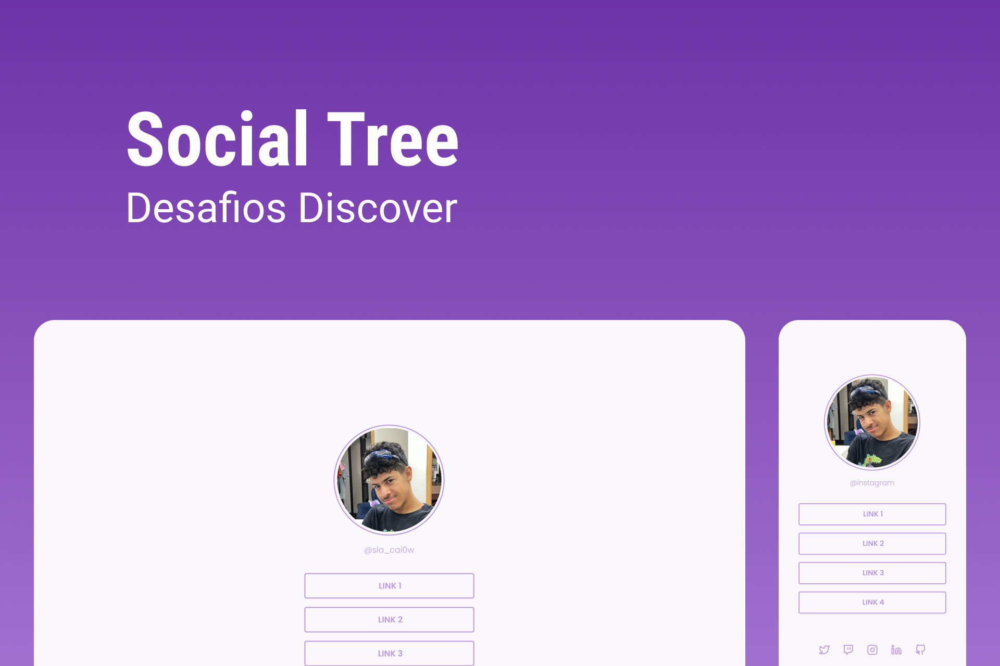

<h1 align="center"> Social Tree </h1>

  Social Tree is a link aggregator to use on social media  

  <a href="#-tecnologias">Technologies</a>&nbsp;&nbsp;&nbsp;|&nbsp;&nbsp;&nbsp;
  <a href="#-projeto">Project</a>&nbsp;&nbsp;&nbsp;|&nbsp;&nbsp;&nbsp;
  <a href="#-layout">Layout</a>&nbsp;&nbsp;&nbsp;|&nbsp;&nbsp;&nbsp;
  <a href="#memo-licença">License</a>

  

 

  

## 🚀 Technologies

This project was developed with the following technologies:

- HTML e CSS
- Git e Github
- Figma

## 💻 Project

Social Tree is a project developed at an event of the ( Desafio Discover ) by [Rocketseat](https://app.rocketseat.com.br).

- [Access the finished project, online](https://caiosena.github.io/SocialTree)

## 🔖 Layout

You can preview the project layout through [FROM THIS LINK](https://www.figma.com/file/yi1ycIyAW8QiGiX9bMFHkU/DD-%2F-Social-links). It is necessary to have account on [Figma](https://figma.com) to access it.

## :memo: License

This project is licensed under the MIT license.

---

Made with ♥ by Caio Sena